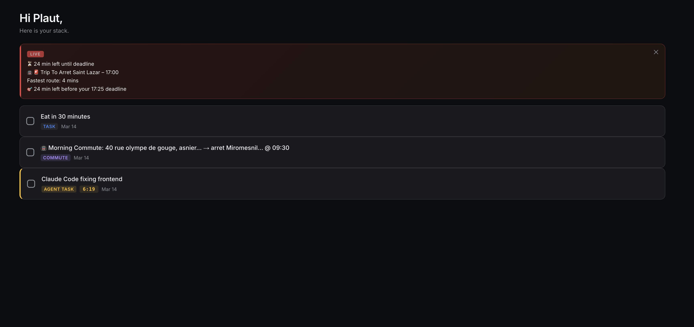

# HStack : First step toward symbiosis

**The auto-kanban for normal people who want to think about less things.**

HStack is an AI-native task management system with configurable LLM providers. You talk to it in plain language — it organizes your life into a visual stack of tickets, tracks your commutes in real time, and monitors your background agent work with countdown timers.

No forms. No dropdowns. Just tell it what's going on.



## Core Concept

HStack replaces traditional task boards with a single conversational interface. Every action — creating tasks, scheduling commutes, checking directions — flows through a natural language chat backed by provider-agnostic tool calling. The AI decomposes complex requests into discrete tool calls automatically.

---

## Features

### Ticket Management

Talk to the AI to create, edit, delete, and complete tickets. Each ticket is auto-classified:

| Type | Purpose | Example |
| --- | --- | --- |
| **TASK** | One-off action items | *"Buy groceries"* |
| **HABIT** | Daily routines and recurring behaviors | *"Exercise every morning"* |
| **EVENT** | Time-specific appointments | *"Dentist at 3pm tomorrow"* |
| **COMMUTE** | Recurring transit routes with live alerts | *"I go from Asnières to Saint-Lazare every morning at 9:30"* |
| **AGENT_TASK** | Background AI/IDE work with countdown timer | *"VSCode is refactoring my auth module"* |

The AI handles multi-action decomposition — a message like *"Get laundry detergent for mum and kibble for the cat"* becomes multiple discrete tickets in one turn.

### Commute Management

Describe a recurring trip and HStack registers it as a commute:

- **Automatic alerts** — 30 minutes before your deadline, the system starts polling Google Maps Directions every 5 minutes
- **Transit-first** — shows departure times, line names, and walk segments for public transit routes
- **Day scheduling** — specify which days (defaults to weekdays) and arrival time in HH:MM
- **Background scheduler** — an asyncio loop checks all commutes every 60 seconds, no user action needed

### Live / Urgent Directions

For one-time urgent trips (*"I need to get to the airport in 45 minutes"*):

- Immediate directions response with transit options
- Automatic re-polling every 5 minutes until the deadline expires
- Persistent banner notifications with a pulsing **LIVE** badge
- Auto-cleanup when the deadline passes

### Agent Task Timers

When an AI agent or IDE is working on something in the background:

- Creates a ticket with a live **MM:SS countdown timer**
- Default duration: 10 minutes (customizable)
- Auto-deletes from the database when the timer expires
- Visual pulsing amber indicator on the ticket card
- Triggered by natural phrases: *"Cursor is fixing the tests"*, *"Copilot is generating the migration"*

### Notification System

- **Single notification policy** — only one alert banner visible at a time; new alerts replace the previous one
- **Persistent banners** — active commute/live-trip alerts stay on screen until replaced by the next update
- **Expired alerts** auto-dismiss after 10 seconds
- **Reset clears everything** — clearing the stack also cancels all schedulers, live trips, and alert banners

---

## Architecture

HStack uses a **local-first, shared-core** architecture to ensure maximum performance, privacy, and reliability across platforms.

```text
┌─────────────────────────────────────────────────┐
│                Frontend (Tauri)                 │
│      React · Framer Motion · Tailwind CSS       │
│    (Invokes Rust commands for logic/sync)       │
└───────────────┬─────────────────┬───────────────┘
                │                 │
        ┌───────▼───────┐  ┌─────▼──────────────┐
        │  hstack-app    │  │   hstack-core      │
        │ (Tauri / Rust) │  │  (Shared Logic)    │
        │ Security/Vault │  │  LLM Providers     │
        │ Local Store    │  │  Sync Engine       │
        └───────┬───────┘  └─────┬──────────────┘
                │                 │
        ┌───────▼─────────────────▼───────┐
        │        System Keychain          │
        │  (macOS Secure Enclave / Win / Linux)│
        │  Hardware-encrypted API Keys    │
        └─────────────────────────────────┘
```

| Component | Tech | Role |
| --- | --- | --- |
| **Core** | Rust (`hstack-core`) | Shared business logic, LLM providers (Gemini/OpenAI), deterministic sync hashing |
| **App** | Tauri (`hstack-app`) | Native desktop shell, OS Keychain integration (Security), local state projection |
| **Frontend** | React, Vite, Lucide | Interaction UI, ticket visualization, WebGL aesthetics |
| **Security** | `keyring` (Rust) | Hardware-backed encryption for all LLM API keys |
| **Sync** | Approach A (Projection) | Projection-based local-first state: `project(Base, PendingActions)` |

---

## Getting Started

### Prerequisites

- [Rust](https://www.rust-lang.org/tools/install) (latest stable)
- [Node.js](https://nodejs.org/) & `npm`
- [Tauri Dependencies](https://tauri.app/v1/guides/getting-started/prerequisites) (OS specific)

### Development

**1. Install Dependencies:**

```bash
# Root
npm install
cd frontend && npm install
```

**2. Run the Desktop App:**

You can now launch the entire stack (Frontend + Rust Backend) directly from the project root:

```bash
npm run dev
```

*Note: The first run will compile the Rust core and download necessary crates, which may take a few minutes. Subsequent runs are much faster.*

**Reset the Welcome Screen During Development:**

If you want to replay the onboarding or welcome flow, remove the app settings file with the helper script:

```bash
npm run reset:welcome
```

This helper derives the settings location from the Tauri app identifier and supports macOS and Linux without hardcoding a user-specific path.

### Security Configuration

HStack stores your API keys in your system's **Hardware-Encrypted Keychain**. To configure:

1. Open the app.
2. Click the **Settings Gear** in the top-right.
3. Add a new LLM provider (Google Gemini or OpenAI-compatible like Ollama).
4. Paste your API key — it will be saved securely to your OS and never written to disk in plaintext.

---

## API Endpoints

The public repo currently ships a lightweight auth/tasks server in `crates/hstack-server-lite`. The desktop app can also run fully local flows through Tauri commands without using these HTTP endpoints.

| Method | Path | Description |
| --- | --- | --- |
| `GET` | `/api/tasks?userid=N` | Fetch structured task objects for a user from the lite server |
| `POST` | `/api/tasks?userid=N` | Create a task for a user in the lite server |
| `POST` | `/api/auth/register` | Create a new user account |
| `POST` | `/api/auth/login` | Authenticate an existing user |

---

## AI Tool System

Gemini has access to these function-calling tools:

| Tool | Action |
| --- | --- |
| `create_ticket` | Create a TASK, HABIT, or EVENT |
| `edit_ticket` | Modify an existing ticket's title or type |
| `delete_ticket` | Remove a specific ticket by ID |
| `delete_all_tickets` | Clear the entire stack |
| `add_commute` | Register a recurring commute with schedule |
| `remove_commute` | Delete a registered commute |
| `get_directions` | One-shot transit directions between two points |
| `start_live_directions` | Begin live tracking for an urgent trip |
| `create_agent_task` | Start a timed background agent task |

The AI can invoke **multiple tools in a single turn** to decompose complex requests.

---

## Project Structure

```text
HStack/
├── crates/
│   ├── hstack-app/          # Tauri desktop shell and native commands
│   ├── hstack-core/         # Shared contracts, LLM/provider logic, sync projection
│   └── hstack-server-lite/  # Public minimal auth/tasks HTTP server
├── frontend/                # React/Vite frontend rendered inside Tauri
├── docs/                    # Licensing and public/private boundary docs
├── scripts/                 # Development helpers
└── tests/                   # Remaining repo-level tests
```

---

## Vision

HStack is building toward a world where your task board is a living, breathing system that understands context, not just input.

**Where we are:**

- Natural language ticket management with AI decomposition
- Real-time transit awareness baked into daily planning
- Background agent monitoring as a first-class task type

**Where we're going:**

- **Contextual auto-scheduling** — the system learns your patterns and pre-populates your day before you wake up
- **Cross-agent orchestration** — HStack becomes the central hub that dispatches work to Cursor, Copilot, Claude, and other agents, tracking all of them with live timers
- **Predictive commute intelligence** — instead of polling on a schedule, the system anticipates delays and proactively reroutes you
- **Ambient awareness** — calendar, weather, traffic, and energy levels feed into ticket prioritization automatically
- **Multi-user coordination** — shared stacks where teams see each other's context without status meetings
- **Voice-first interface** — talk to HStack while walking, driving, or cooking — no screen required

The end state: a system that thinks about your day so you don't have to.

---

## License

HStack uses a split-license model in this public repository:

- The open product code is licensed under GPL-3.0-only.
- `crates/hstack-core` is licensed under MPL-2.0.

This matches the project architecture:

- the public app and lite server remain strongly open when redistributed
- the shared contract layer stays reusable across the public and private boundary without forcing the same copyleft scope

See [docs/licensing.md](docs/licensing.md) and [docs/public-private-contract.md](docs/public-private-contract.md) for the rationale.
