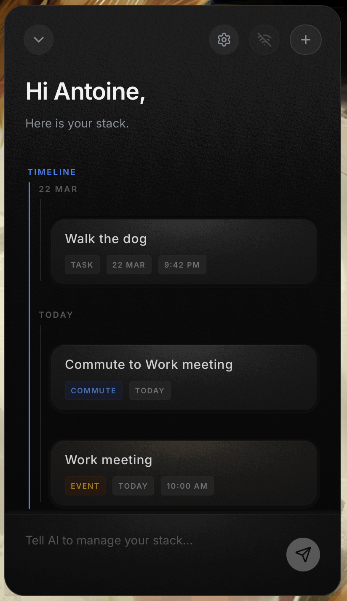

# HStack

<p align="center">
  <strong>The AI-native stack for people who want to think about less stuff.</strong>
</p>

<p align="center">
  
  
  
  
  
  
  
  
</p>

<p align="center">
  HStack turns plain-language intent into a living stack of tickets, commutes, schedules, and background agent work.<br />
  No forms. No board micromanagement. Just tell it what is happening.
</p>

> [!WARNING]
> HStack is currently in alpha and under active development. Features, data models, UI behavior, and setup flows can change significantly between revisions.

<p align="center">
  
</p>

<p align="center">
  Current HStack interface preview on macOS. The mobile build uses the same visual design.
</p>

## What HStack Is

HStack is a local-first task system built around conversation instead of manual ticket entry.

You speak naturally. The app decomposes that request into structured tickets, keeps time-aware items grouped into a visual timeline, tracks commute timing, and supports countdown tickets for time-bound work.

The core idea is simple:

- natural language in
- structured ticket state out
- AI-assisted planning without turning the product into a spreadsheet

## Why It Feels Different

Traditional task tools make you translate your life into fields, labels, boards, and recurring-rule builders.

HStack flips that:

- you say what you need
- the model chooses the right tool calls
- the app projects the result into a focused visual stack

That makes it good at the things normal task apps usually make annoying:

- splitting one messy sentence into multiple tickets
- turning a real appointment into a proper scheduled event
- generating commute tickets that stay tied to arrival time
- tracking time-bound work with countdown tickets instead of burying it in notes

## Implemented Today

These are already present in the public product today.

| Capability | What it does |
| --- | --- |
| Conversational ticketing | Create, edit, complete, and delete tickets from plain language |
| Timeline projection | Automatically groups scheduled tickets into a day/week stack |
| Commute awareness | Creates commute tickets with transit-first routing and alert windows |
| Live urgent directions | Keeps refreshing short-lived travel guidance until the deadline expires |
| Countdown tickets | Tracks time-bound work with live countdown UI and expiry behavior |
| Local-first sync model | Projects state from durable base state plus pending actions |
| Secure provider storage | Stores LLM API keys in the system keychain rather than plaintext files |

## Still To Build

These belong to the public roadmap and are not being presented as finished product behavior.

| Roadmap area | What is left to implement |
| --- | --- |
| Planner hardening | More transcript-based regression coverage, stronger dependency-aware planning, stricter planner validation |
| Shared scheduling evolution | Continue reducing duplicated scheduling logic while keeping type-specific semantics explicit |
| Richer ticket rendering | Push type-specific layouts further so each ticket class exposes more structured context intentionally |
| Minimal map experience | Extend commute UX carefully beyond external map links without jumping straight to embedded maps |
| Ticket status and priority | Add optional cross-type status and priority fields with UI support |
| Proactive planning | Move from reactive ticket creation toward more proactive schedule assistance |
| Cross-agent orchestration | Better visibility and coordination across external agents and IDE-driven work |
| Multi-user coordination | Shared stacks and coordination flows across people are still ahead |

For the tracked public roadmap, see [ROADMAP.md](ROADMAP.md).

## Ticket Types

Every created item lands in a typed model instead of becoming an unstructured chat log.

| Type | Purpose | Example |
| --- | --- | --- |
| `TASK` | One-off action item | `Buy groceries` |
| `HABIT` | Repeatable routine | `Exercise every morning` |
| `EVENT` | Time-specific commitment | `Dentist at 3pm tomorrow` |
| `COMMUTE` | Scheduled trip with routing context | `I go from Asnieres to Saint-Lazare every morning at 9:30` |
| `COUNTDOWN` | Time-bound item with countdown behavior | `Finish this in 10 minutes` |

One useful property of the tool system is multi-action decomposition. A message like `Get laundry detergent for mum and kibble for the cat` can become multiple distinct tickets in a single turn.

## Implemented Feature Detail

### Conversational Ticket Management

- Create, edit, delete, and complete tickets through chat
- Project mixed ticket types into one continuous stack
- Keep structured scheduling data instead of loose notes
- Preserve typed ticket payloads across app and sync boundaries

### Commute Management

- Register recurring trips with arrival-time semantics
- Poll routing providers when a deadline window is active
- Show transit-first route details such as departures, lines, and walk segments
- Keep commute tickets related to the events they support

### Live Directions

- Handle urgent one-off travel requests
- Refresh directions repeatedly until the trip deadline expires
- Surface active travel state through persistent alerts
- Clean up expired travel sessions automatically

### Countdown Tickets

- Create tickets for time-bound work
- Run with live countdown behavior
- Auto-expire when the work window closes
- Keep deadlines and short-lived work visible in the same planning surface

### Notifications

- Only one alert banner is shown at a time
- New alerts replace older ones instead of stacking noisy toasts
- Expired alerts dismiss automatically
- Clearing the stack also clears runtime alert state

## Architecture

HStack is organized as a shared-core, local-first system.

```text
┌─────────────────────────────────────────────────┐
│                Frontend (Tauri)                 │
│      React · Vite · Tailwind CSS · Lucide       │
│    Renders state and invokes native commands    │
└───────────────┬─────────────────┬───────────────┘
                │                 │
        ┌───────▼───────┐  ┌─────▼──────────────┐
        │  hstack-app   │  │   hstack-core      │
        │ Tauri / Rust  │  │ Shared contracts   │
        │ Local state   │  │ Provider logic     │
        │ Sync runtime  │  │ Sync projection    │
        └───────┬───────┘  └─────┬──────────────┘
                │                 │
        ┌───────▼─────────────────▼───────┐
        │         System Keychain         │
        │ Hardware-backed provider secrets│
        └─────────────────────────────────┘
```

| Component | Tech | Role |
| --- | --- | --- |
| `hstack-core` | Rust | Shared business logic, contracts, provider integrations, sync projection |
| `hstack-app` | Tauri + Rust | Native shell, secure storage, sync transport, local persistence |
| `frontend` | React + Vite | Visual stack, onboarding, chat UI, settings, mobile/desktop rendering |
| `hstack-server-lite` | Rust + Axum | Public lightweight auth and ticket backend |

## Local-First Model

The app is designed so the browser UI does not own canonical sync state.

Instead, the Tauri Rust layer keeps durable state in local stores and projects the visible stack from:

- base state
- pending actions

That gives the product a few important properties:

- better offline tolerance
- deterministic state projection
- less browser-only shadow state
- safer sync ownership boundaries

## Getting Started

### Prerequisites

- [Rust](https://www.rust-lang.org/tools/install)
- [Node.js](https://nodejs.org/) and `npm`
- [Tauri prerequisites](https://tauri.app/start/prerequisites/)

### Install Dependencies

From the repo root:

```bash
npm install
npm install --prefix frontend
```

### Run The Desktop App

```bash
npm run dev
```

The first run compiles the Rust side and can take a while. Iteration after that is much faster.

### Reset The Welcome Flow During Development

```bash
npm run reset:welcome
```

That helper removes the derived app settings file without hardcoding a machine-specific path.

## Android

The Android packaging flow for this repo is documented in:

- [docs/android-build.md](docs/android-build.md)

For the normal device loop, use the repo script:

```bash
npm run android:reinstall
```

That script handles build, signing, reinstall, and app launch through `adb`.

## Security And Provider Configuration

HStack stores provider secrets in the system keychain rather than writing API keys to plaintext project config.

To configure a provider:

1. Open the app.
2. Open settings.
3. Add a provider such as Gemini or an OpenAI-compatible endpoint.
4. Paste the API key.

The key is stored through native secure storage.

## Public API Surface

This public repo ships a lightweight HTTP server in `crates/hstack-server-lite`. The desktop app can also run local flows without depending on those HTTP routes.

| Method | Path | Description |
| --- | --- | --- |
| `GET` | `/api/tickets?userid=N` | Fetch structured tickets for a user |
| `POST` | `/api/tickets?userid=N` | Create a ticket for a user |
| `POST` | `/api/auth/register` | Create a user account |
| `POST` | `/api/auth/login` | Authenticate an existing user |

## AI Tooling Model

The model operates through typed tools rather than freeform guessing.

| Tool | Action |
| --- | --- |
| `create_ticket` | Create a `TASK`, `HABIT`, or `EVENT` |
| `edit_ticket` | Modify an existing ticket |
| `delete_ticket` | Remove one ticket by ID |
| `delete_all_tickets` | Clear the stack |
| `add_commute` | Register a recurring commute |
| `remove_commute` | Delete a commute |
| `get_directions` | Fetch one-shot directions |
| `start_live_directions` | Start live refresh for an urgent trip |
| `create_countdown` | Start a timed countdown ticket |

This is what lets HStack turn one messy sentence into multiple concrete state changes.

## Project Structure

```text
HStack/
├── crates/
│   ├── hstack-app/          # Tauri shell and native commands
│   ├── hstack-core/         # Shared contracts and logic
│   └── hstack-server-lite/  # Public minimal backend
├── frontend/                # React/Vite UI rendered inside Tauri
├── docs/                    # Build, licensing, and boundary docs
├── scripts/                 # Development helpers
└── tests/                   # Repo-level tests
```

## Product Direction

HStack is aiming for a planning surface that feels less like project management software and more like ambient operational memory.

Already implemented:

- natural language ticket management
- timeline-aware planning
- commute-aware scheduling
- visible background agent work

Still to implement:

- more proactive scheduling
- stronger cross-agent orchestration
- smarter commute prediction
- richer context-aware prioritization
- coordinated multi-user stacks

The end goal is not a prettier board. It is a system that removes planning friction from ordinary life.

## License

This public repository uses a split-license model:

- Product code is licensed under GPL-3.0-only.
- `crates/hstack-core` is licensed under MPL-2.0.

That matches the project boundary:

- the public app and lite server remain strongly open when redistributed
- the shared contract layer stays reusable across the public/private split without forcing the same copyleft scope everywhere

See [docs/licensing.md](docs/licensing.md) and [docs/public-private-contract.md](docs/public-private-contract.md) for the rationale.
